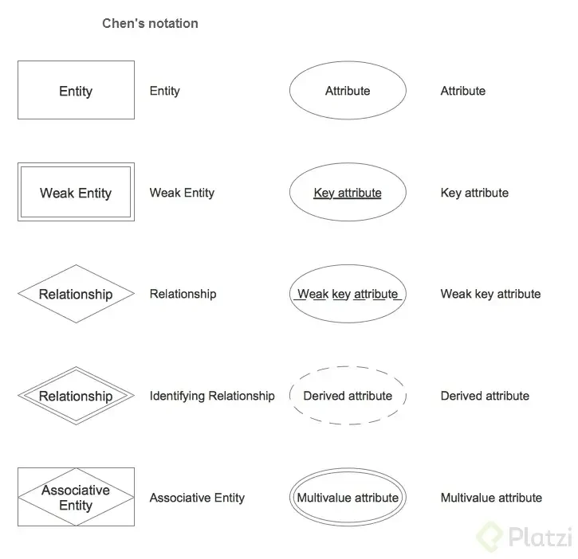
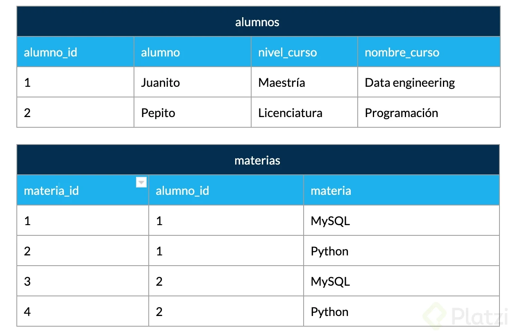
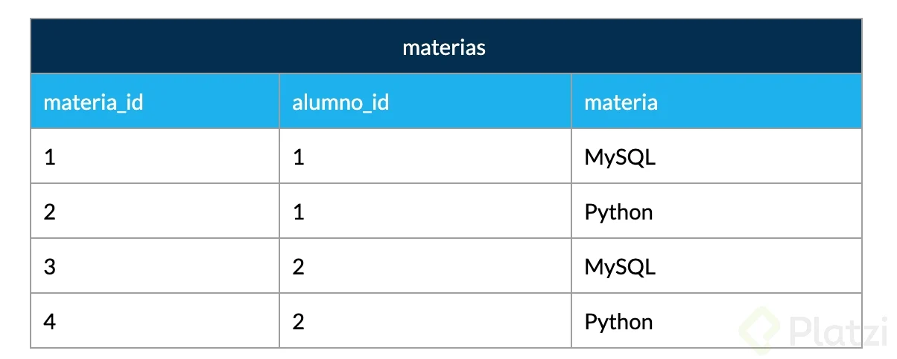
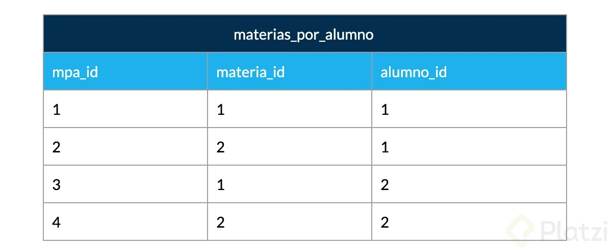

# Curso de fundamentos de bases de datos 
## Tipos de bases de datos
* ***Relacionales:*** En la industria hay varias compañías dedicadas a ser manejadoras de bases de datos relacionales como SQL Server, Oracle, MariaDB, entre otras.
* ***No relacionales:*** Todavía están avanzando y existen ejemplos muy distintos como cassandra, elasticsearch, neo4j, MongoDB, entre otras.

* Servicios:

* ***Auto administrados:*** Es la base de datos que instalas tú y te encargas de actualizaciones, mantenimiento, etc.
* ***Administrados:*** Servicios que ofrecen las nubes modernas como Azure y no debes preocuparte por mantenimiento o actualizaciones.

## En esta primera prueba de bases de datos vas a usar SQL, el lenguaje para hacer consultas en bases de datos relacionales.

En el editor de código encuentras un primer ejemplo de la sentencia SELECT para imprimir datos en la consola.

Tu desafío es replicar esa sentencia para imprimir los siguientes valores:

* 2 + 2 (la sentencia de prueba que ya encuentras en el editor)
* 18/3

* "Esto es una sentencia SELECT" (no olvides las comillas ")
Escribe las 3 sentencias, imprime el resultado en la consola y corre las pruebas para comprobar que completaste el desafío.

* ***💡 Recuerda que esta es la primera prueba. En las próximas clases aprenderás a profundidad cómo funciona SELECT, más sentencias SQL y otros tipos de bases de datos.***

        RESUELTO 
        SELECT (2+2);
        SELECT (18/3);
        SELECT ("Esto es una sentencia SELECT");

## Bases de datos relacionales (RBD)

Es importante que sea fácil de guardar y extraer, anteriormente se usaban bases de datos basadas en archivos, el cuál era texto plano fácil de guardar, pero difícil de extraer, por esto se inventaron las bases de datos relacionales. 
En 1990 Codd se preocupó porque los sistemas de gestión de bases de datos (SGBD) que decían ser relacionales, no lo eran.  En la práctica es difícil cumplir las 12 pero, un SGBD es más relacional cuantas más reglas cumpla

### Las Reglas y mandamientos de Edgar Frank Ted Codd

* ***Regla 0: Regla de fundación.*** 
    * a) Cualquier sistema que se proclame como relacional, debe ser capaz de gestionar sus bases de datos enteramente mediante sus capacidades relacionales.

* ***Regla 1:*** Regla de la información.
    * a) Todos los datos deben estar almacenados en las tablas
    * b) Esas tablas deben cumplir las premisas del modelo relacional
    * c) No puede haber información a la que accedemos por otra vía

* ***Regla 2:*** Regla del acceso garantizado.
    * a) Cualquier dato es accesible sabiendo la clave de su fila y el nombre de su columna o atributo
    * b) Si a un dato no podemos acceder de esta forma, no estamos usando un modelo relacional

* ***Regla 3:*** Regla del tratamiento sistemático de valores nulos.
    * a) Esos valores pueden dar significado a la columna que los contiene
    * b) El SGBD debe tener la capacidad de manejar valores nulos
    * c) El SGBD reconocerá este valor diferenciándolo de cualquier otro
    * d) El SGBD deberá aplicársele la lógica apropiada
    * e) Es un valor independiente del tipo de datos de la columna

* ***Regla 4:*** Catálogo dinámico en línea basado en el modelo relacional.
    * a) El catálogo en línea es el diccionario de datos
    * b) El diccionario de datos se debe de poder consultar usando las mismas técnicas que para los datos
    * c) Los metadatos, por tanto, se organizan también en tablas relacionales
    * d) Si SELECT es una instrucción que consulta datos, también será la que consulta los metadatos

* ***Regla 5:*** Regla comprensiva del sublenguaje de los datos completo.
    * a) Al menos tiene que existir un lenguaje capaz de hacer todas las funciones del SGBD
    * b) No puede haber funciones fuera de ese lenguaje
    * c) Puede haber otros lenguajes en el SGBD para hacer ciertas tareas
    * d) Pero esas tareas también se deben poder hacer con el “lenguaje completo”

* ***Regla 6:*** Regla de actualización de vistas.
    * a) Las vistas tienen que mostrar información actualizada
    * b) No puede haber diferencias entre los datos de las vistas y los datos de las tablas base

* ***Regla 7:*** Alto nivel de inserción, actualización, y cancelación.
    * a) La idea es que el lenguaje que maneja la base de datos sea muy humano
    * b) Eso implica que las operaciones del lenguaje de manipulación de los datos (DML) trabajen con conjuntos de filas a la vez
    * c) Para modificar, eliminar o añadir datos, no hará falta programar de la forma en la que lo hacen los lenguajes de tercera generación como C o Java

* ***Regla 8:*** Independencia física de los datos.
    * a) Cambios en la física de la BD no afecta a las aplicaciones ni a los esquemas lógicos
    * b) El acceso a las tablas (elemento lógico) no cambia porque la física de la base de datos cambie

* ***Regla 9:*** Independencias lógicas de los datos.
    * a) Cambios en el esquema lógico (tablas) de la BD no afectan al resto de esquemas
    * b) Si cambiamos nombres de tabla, o de columna o modificamos información de las filas, las aplicaciones (esquema externo) no se ven afectadas
    * c) Es más difícil de conseguir

* ***Regla 10:*** Independencia de la integridad.
        * a) Las reglas de integridad (restricciones) deben de ser gestionadas y almacenadas por el SGBD

* ***Regla 11:*** Independencia de la distribución.
        * a) Que la base de datos se almacene o gestione de forma distribuida en varios servidores, no afecta al uso de esta ni a la programación de las aplicaciones de usuario
        * b) El esquema lógico es el mismo independientemente de si la BD es distribuida o no

* ***Regla 12:*** La regla de la no subversión.
    * a) La base de datos no permitirá que exista un lenguaje o forma de acceso, que permita saltarse las reglas anteriores
## Qué son entidades y atributos

En bases de datos, una entidad es la representación de un objeto o concepto del mundo real que se describe en una base de datos. Las entidades se describen en la estructura de la base de datos empleando un modelo de datos.

### ¿Qué es una entidad?
Una entidad es algo similar a un objeto (programación orientada a objetos) y representa algo en el mundo real, incluso algo abstracto. Tienen atributos que son las cosas que los hacen ser una entidad y por convención se ponen en plural.

### Ejemplo de entidad en bases de datos
En la imagen puedes observar como ejemplo que la enidad Laptops posee diferentes atributos como colo, pantalla, año, modelo, etc.

### ¿Qué es un atributo?
Son las características o propiedades que describen a la entidad (se encierra en un óvalo). Los atributos se componen de: 

Los atributos compuestos son aquellos que tienen atributos ellos mismos. 

### Los atributos llave son aquellos que identifican a la entidad y no pueden ser repetidos. Existen:

* ***Naturales:*** son inherentes al objeto como el número de serie

* ***Clave artificial:*** no es inherente al objeto y se asigna de manera arbitraria.
Tipos de entidades
* ***Entidades fuertes:*** son entidades que pueden sobrevivir por sí solas.

* ***Entidades débiles:*** no pueden existir sin una entidad fuerte y se representan con un cuadrado con doble línea.

* ***Identidades débiles por identidad:*** no se diferencian entre sí más que por la clave de su identidad fuerte.
* ***Identidades débiles por existencia:*** se les asigna una clave propia.

### Cómo representar las entidades en bases de datos?
Existen varios tipos de notaciones para los modelos entidad relacionamiento. Chen es uno de los más utilizados para diagramar lógicamente la base de datos. Aquí te mostramos un ejemplo.

## Relaciones

Las relaciones nos permiten ligar o unir nuestras diferentes entidades y se representan con rombos. Por convención se definen a través de verbos. 

Las relaciones tienen una propiedad llamada cardinalidad y tiene que ver con números. Cuántos de un lado pertenecen a cuántos del otro lado: 

* Cardinalidad: 1 a 1
* Cardinalidad: 0 a 1
* Cardinalidad: 1 a N
* Cardinalidad: 0 a N

Cantidad N a N

## Tipos de dato

Para llevar a la práctica un diagrama debemos ir más allá y darle detalle con parámetros como: 

Tipos de dato: 

* Texto: CHAR(n), VARCHAR(n), TEXT
* Números: INTEGER, BIGINT, SMALLINT, DECIMAL(n,s), NUMERIC(n,s)
* Fecha/hora: DATE, TIME, DATETIME, TIMESTAMP
* Lógicos: BOOLEAN
* Constraints (Restricciones)

    

* NOT NULL: Se asegura que la columna no tenga valores nulos
* UNIQUE: Se asegura que cada valor en la columna no se repita
* PRIMARY KEY: Es una combinación de NOT NULL y UNIQUE
* FOREIGN KEY: Identifica de manera única una tupla en otra tabla
* CHECK: Se asegura que el valor en la columna cumpla una condición dada
* DEFAULT: Coloca un valor por defecto cuando no hay un valor especificado
* INDEX: Se crea por columna para permitir búsquedas más rápidas

    

## Normalizacion 

La normalización como su nombre lo indica nos ayuda a dejar todo de una forma normal. Esto obedece a las 12 reglas de Codd y nos permiten separar componentes en la base de datos: 

* Primera forma normal (1FN): Atributos atómicos (Sin campos repetidos)
* Segunda forma normal (2FN): Cumple 1FN y cada campo de la tabla debe depender de una clave única.
* Tercera forma normal (3FN): Cumple 1FN y 2FN y los campos que NO son clave, NO deben tener dependencias.
* xCuarta forma normal (4FN): Cumple 1FN, 2FN, 3FN y los campos multivaluados se identifican por una clave única.

### 1FN Primera forma normal: 
Atributos atómicos (Sin campos repetidos). Esto quiere decir que ningún campo puede tener el mismo tipo de valor como varios campos materia (materia1, materia2,…).

### 2FN Segunda forma normal: 
Cumplir con 1FN y Cada campo de la tabla debe depender de una clave única. Es decir en las tablas no se puede repetir los campos primarios ya que los mismos son únicos por tanto si existe una relación uno a muchos se debe crear una tabla aparte donde cohabitaran la llave primaria de la primera tabla y la llave primaria de la segunda tabla de esta forma logramos relacionar de manera efectiva dos tablas respetando las llaves primarias.

### 3FN Tercera forma normal: 
Cumple 1FN y 2FN y los campos que NO son clave NO deben tener dependencias. Esto nos indica que todos los campos de la tabla deben estar estrechamente relacionados con el campo primario y no serlo de manera transitiva, por ejemplo, en una tabla torneos tenemos el código del torneo el nombre el ganador y la fecha de nacimiento del ganador, como observamos no podemos tener la fecha de nacimiento del ganador en dicha tabla ya que no está relacionada para nada con el torneo y además existe la posibilidad que en varios registros el mismo ganador tenga diferentes fechas de nacimiento por lo cual no mantendría la consistencia de los datos.

### 4FN Cuarta forma normal:
Cumplir 1FN 2FN y 3FN. Los campos multivaluados se identifican por una clave única. Cuando relacionamos dos tablas totalmente independientes cada una de la otra debemos relacionarlas a través de una tabla aparte de las mismas donde solo colocaremos las llaves primarias de cada tabla ya que colocar cualquier otra información relacionada con las tablas implicaría repetir datos, además de hacer la tarea de actualización de registros primarias más compleja, ya que por ejemplo si deseo actualizar el nombre del curso no solo lo tendría que hacer en la tabla cursos sino también en cada tabla donde coloque el nombre lo cual no garantiza la integridad de la información, adiciona información innecesaria en los registros y hace más complejo el trabajo de administrar los datos.

## Formas normales en Bases de Datos relacionales (Implementacion)

La normalización en las bases de datos relacionales es uno de esos temas que, por un lado es sumamente importante y por el otro suena algo esotérico. Vamos a tratar de entender las formas normales (FN) de una manera simple para que puedas aplicarlas en tus proyectos profesionales.

### Primera Forma Normal (1FN)
Esta FN nos ayuda a eliminar los valores repetidos y no atómicos dentro de una base de datos. 

Formalmente, una tabla está en primera forma normal si: 

* ***Todos los atributos son atómicos.***Un atributo es atómico si los elementos del dominio son simples e indivisibles.
* ***No debe existir variación en el número de columnas.***
* ***Los campos no clave deben identificarse por la clave (dependencia funcional).***
* ***Debe existir una independencia del orden tanto de las filas como de las columnas; es decir, si los datos cambian de orden no deben cambiar sus significados.***

Se traduce básicamente a que si tenemos campos compuestos como por ejemplo “nombre_completo” que en realidad contiene varios datos distintos, en este caso podría ser “nombre”, “apellido_paterno”, “apellido_materno”, etc. 

También debemos asegurarnos que las columnas son las mismas para todos los registros, que no haya registros con columnas de más o de menos. 

Todos los campos que no se consideran clave deben depender de manera única por el o los campos que si son clave. 

Los campos deben ser tales que si reordenamos los registros o reordenamos las columnas, cada dato no pierda el significado. 

### Segunda Forma Normal (2FN)

Esta FN nos ayuda a diferenciar los datos en diversas entidades. 

Formalmente, una tabla está en segunda forma normal si: 

* ***Está en 1FN***
* ***Sí los atributos que no forman parte de ninguna clave dependen de forma completa de la clave principal. Es decir, que no existen dependencias parciales.***
* ***Todos los atributos que no son clave principal deben depender únicamente de la clave principal.***

Lo anterior quiere decir que sí tenemos datos que pertenecen a diversas entidades, cada entidad debe tener un campo clave separado. Por ejemplo: 

 

 En la tabla anterior tenemos por lo menos dos entidades que debemos separar para que cada uno dependa de manera única de su campo llave o ID. En este caso las entidades son alumnos por un lado y materias por el otro. En el ejemplo anterior, quedaría de la siguiente manera:

 

## Tercera Forma Normal (3FN)

Esta FN nos ayuda a separar conceptualmente las entidades que no son dependientes. 

Formalmente, una tabla está en tercera forma normal si: 

* ***Se encuentra en 2FN***
* ***No existe ninguna dependencia funcional transitiva en los atributos que no son clave***

Esta FN se traduce en que aquellos datos que no pertenecen a la entidad deben tener una independencia de las demás y debe tener un campo clave propio. Continuando con el ejemplo anterior, al aplicar la 3FN separamos la tabla alumnos ya que contiene datos de los cursos en ella quedando de la siguiente manera.

## Cuarta Forma Normal (4FN)
Esta FN nos trata de atomizar los datos multivaluados de manera que no tengamos datos repetidos entre rows. 

Formalmente, una tabla está en cuarta forma normal si: 

* ***Se encuentra en 3FN***
* ***Los campos multivaluados se identifican por una clave única***

Esta FN trata de eliminar registros duplicados en una entidad, es decir que cada registro tenga un contenido único y de necesitar repetir la data en los resultados se realiza a través de claves foráneas. 

Aplicado al ejemplo anterior la tabla materia se independiza y se relaciona con el alumno a través de una tabla transitiva o pivote, de tal manera que si cambiamos el nombre de la materia solamente hay que cambiarla una vez y se propagara a cualquier referencia que haya de ella. 

De esta manera, aunque parezca que la información se multiplicó, en realidad la descompusimos o normalizamos de manera que a un sistema le sea fácil de reconocer y mantener la consistencia de los datos. 

Algunos autores precisan una 5FN que hace referencia a que después de realizar esta normalización a través de uniones (JOIN) permita regresar a la data original de la cual partió. 

